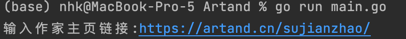
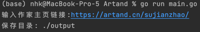

# Artand

## Introduce
针对Artand网站图片的的异步爬虫项目

## How to use
1. 编译与部署
```shell
# 当开发机器操作系统为MacOS
# 部署机器操作系统为Linux时
CGO_ENABLED=0 GOOS=linux GOARCH=amd64 go build main.go
# 部署机器操作系统为Windows时
GOOS=windows GOARCH=amd64 go build main.go

# 当开发机器操作系统为Linux
# 部署机器操作系统为MacOS时
CGO_ENABLED=0 GOOS=darwin GOARCH=amd64 go build main.go 
# 部署机器操作系统为Windows时
GOOS=windows GOARCH=amd64 go build main.go

# 当开发机器操作系统为Windows
# 部署机器操作系统为Mac时
SET CGO_ENABLED=0
SET GOOS=darwin3
SET GOARCH=amd64
go build main.go
# 部署机器操作系统为Windows时
SET CGO_ENABLED=0
SET GOOS=darwin3
SET GOARCH=amd64
go build main.go

# 当部署至本机同类型的操作系统时
go build main.go
```
2. 运行编译好的二进制文件后 
   * 首先要求输入作家的主页链接
    
   * 收入保存目录 
    
3. 结果将保存至项目目录下的output目录下     